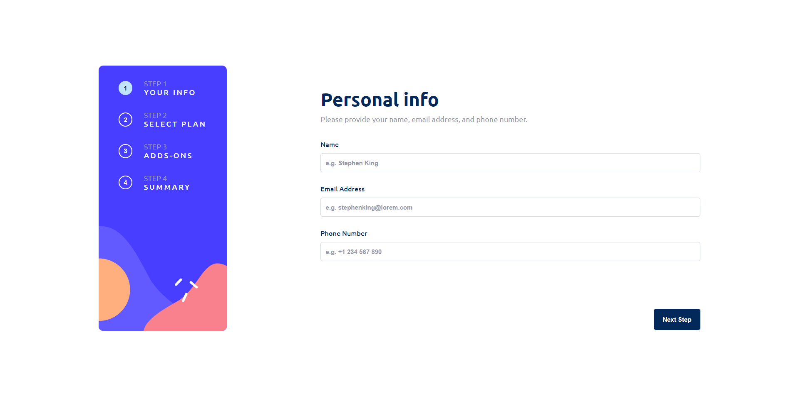
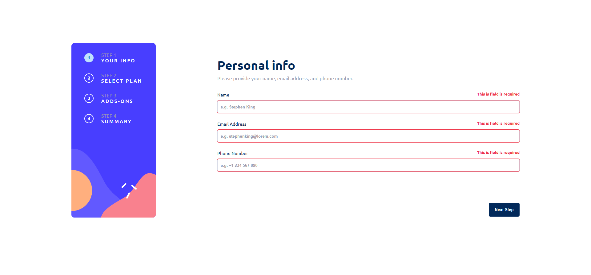
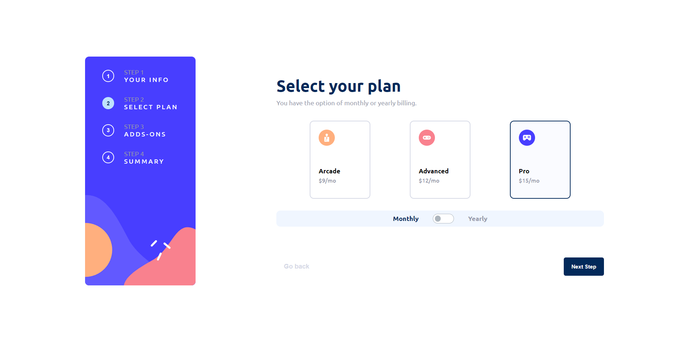
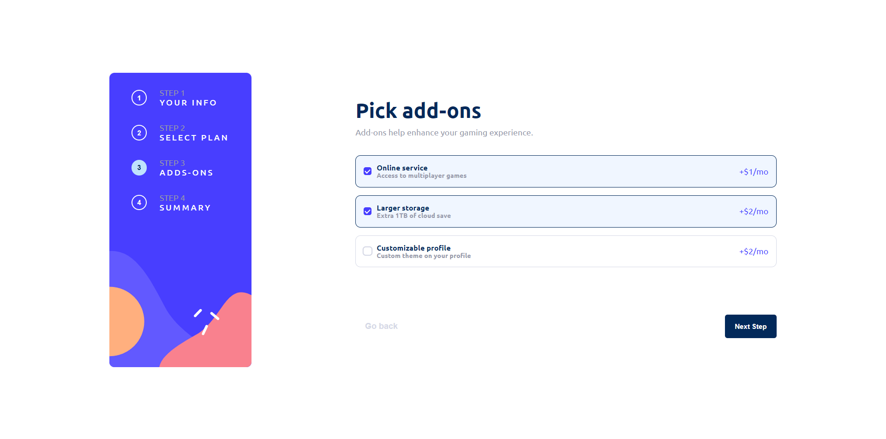
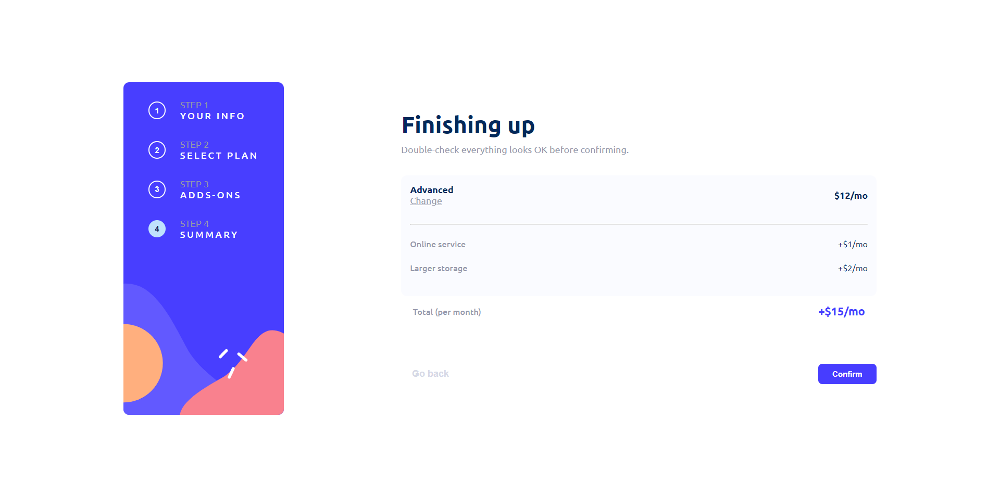
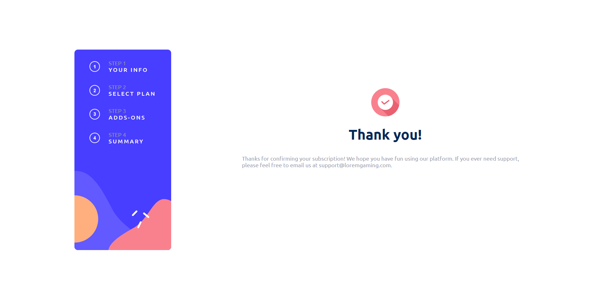
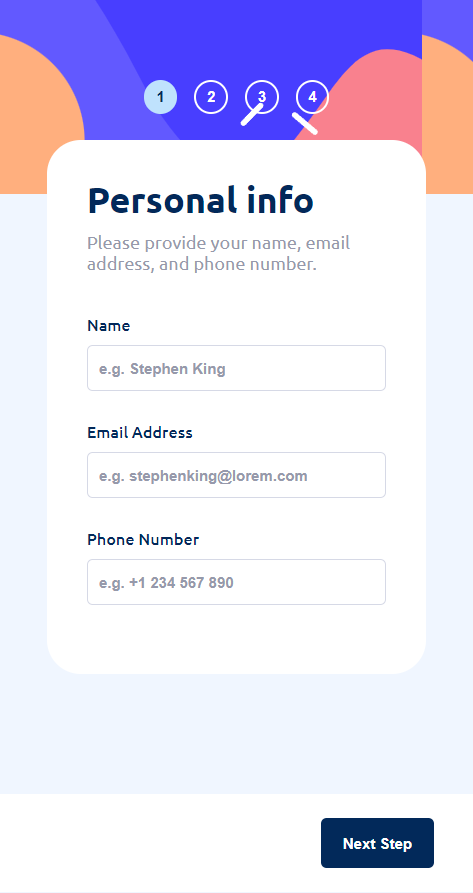
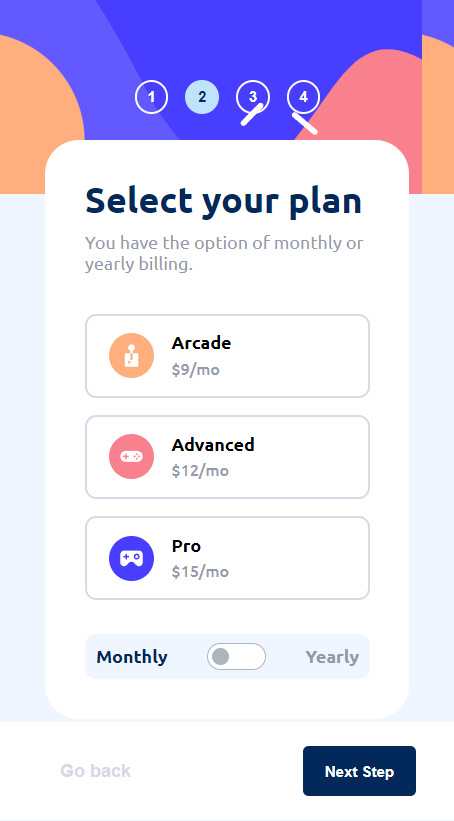

# Frontend Mentor - Multi-step form solution

This is a solution to the [Multi-step form challenge on Frontend Mentor](https://www.frontendmentor.io/challenges/multistep-form-YVAnSdqQBJ). Frontend Mentor challenges help you improve your coding skills by building realistic projects. 

## Overview

### The challenge

Users should be able to:

- Complete each step of the sequence
- See a summary of their selections on the final step and confirm their order
- View the optimal layout for the interface depending on their device's screen size
- See hover and focus states for all interactive elements on the page

### Screenshot

### Links

- Solution URL: [here](https://github.com/jhonatansoto45/multi-step-form)
- Live Site URL: [here](https://multi-step-form-q0rksvfjk-jhonatansoto45.vercel.app/multi-step/your-info)

## My process

### Built with

- Semantic HTML5 markup
- CSS custom properties
- Flexbox
- Mobile-first workflow
- [Angular](https://angular.io/) - JS library
- [Sweet alert 2](https://sweetalert2.github.io/) - Popup

### Continued development

I would like to improve in many aspects of design and programming logic, grid handling in a responsive way. In addition to making many projects of giant size to learn more every day from other developers and improve the quality of code.

## Author

- Frontend Mentor - [@jhonatansoto45](https://www.frontendmentor.io/profile/jhonatansoto45)
- Twitter - [@Bautistajhonata](https://www.twitter.com/bautistajhonata)

